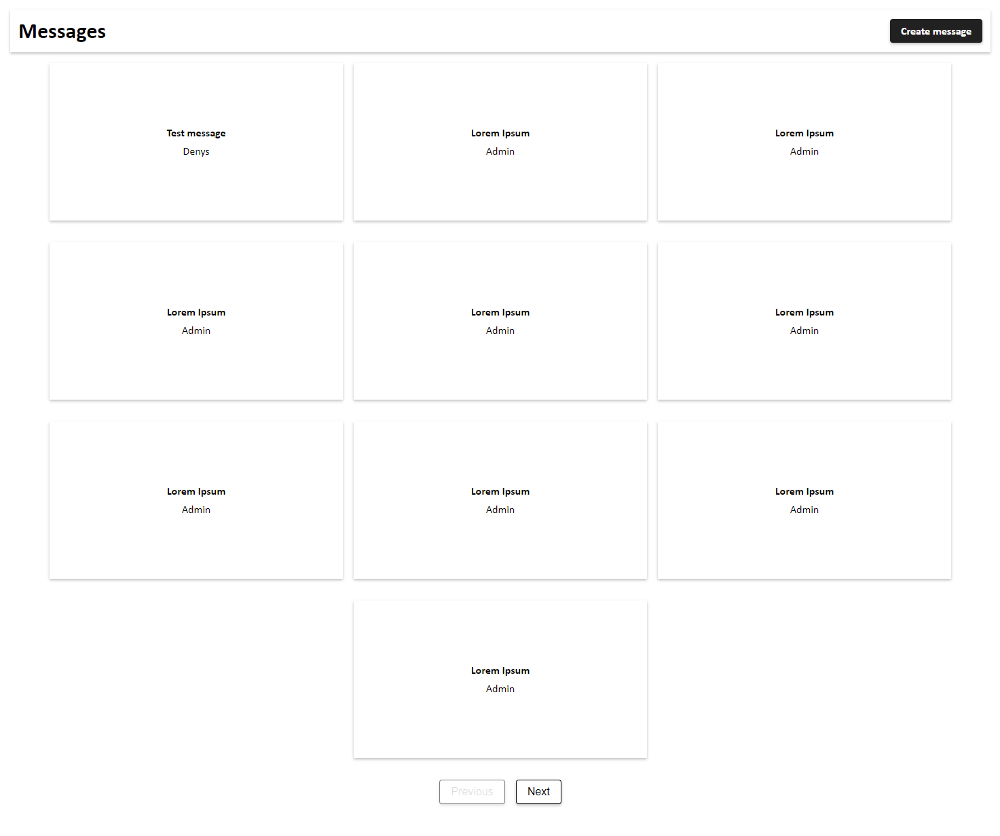
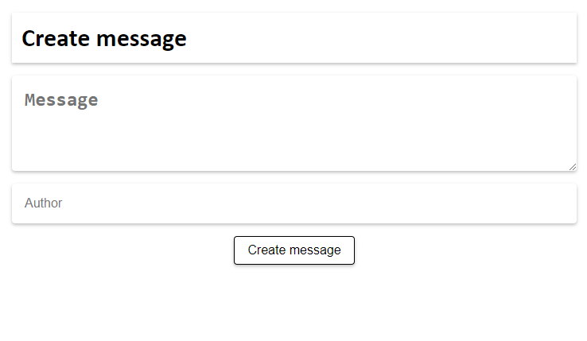

# Messages App

This is a simple web application for creating posts. It is built using React for the frontend, Node.js with Next.js for the backend, and Prisma as an ORM. The database used is MySQL, but it can be replaced with any other database at this stage of development. Deployment is currently set up for local use only. Production deployment is not configured.

Demo: [http://messages.myfunc.io/](https://messages.myfunc.io/)

## Getting Started

To run the application locally, follow these steps:

1. Navigate to the `services` directory:

2. Use the `Makefile` to start the services:

3. The application will be accessible at `http://localhost:3000`.

Please note that the current deployment configuration is suitable for local development only. Production deployment is not yet set up.
